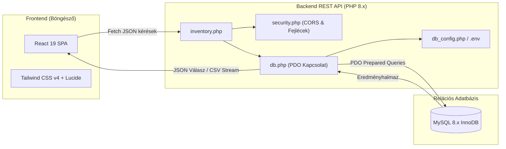
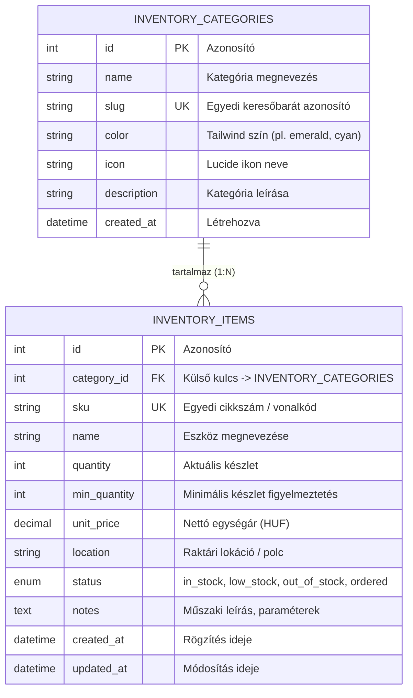

# Adatbázis Alapú Raktár- és Nyilvántartó Rendszer 📦

<p align="center">
  
</p>

<p align="center">
  <a href="https://jannn1.hu/nyilvantarto"></a>
  
  
  
  
  
</p>

---

## 📌 Áttekintés

A rendszer egy modern, nagyvállalati szemléletű **Fullstack Raktár- és Eszköznyilvántartó Alkalmazás**, amelyet **Ár János Dániel** (ELTE IK BSc hallgató) tervezett és fejlesztett.

A projekt célja egy olyan átlátható, villámgyors és biztonságos készletkezelő rendszer megvalósítása, amely valós idejű KPI dashboarddal, intelligens készletfigyelő riasztásokkal, relációs MySQL háttérrel és azonnali Excel/CSV exportálással segíti a logisztikai és IT leltározási feladatokat.

> 🌐 **Élő, működő alkalmazás tesztelése:** [https://jannn1.hu/nyilvantarto](https://jannn1.hu/nyilvantarto)

---

## 🚀 Főbb Funkciók

- 📊 **Valós Idejű Vezérlőpult (KPI Dashboard):**
  - Összes nyilvántartott eszköz és fizikai darabszám összesítés
  - Raktár teljes nettó összértéke (HUF) dinamikus forint formázással
  - Automatikus riasztási mutatók: *Kifogyóban lévő (low stock)*, *Kifogyott (out of stock)* és *Rendelés alatt (ordered)* állagok.
- 🏷️ **Dinamikus Kategóriakezelés:**
  - Kategóriák szerkesztése, létrehozása egyedi Tailwind színkódokkal és Lucide ikonokkal (`Laptop`, `Network`, `Keyboard`, `Printer` stb.).
  - Kategóriánkénti automatikus leltárérték- és darabszám-összesítés.
- ⚡ **1-Kattintásos Készletmódosítás (Quick Adjust):**
  - Azonnali készletnövelés és -csökkentés a táblázat soraiból.
  - Automatikus státuszváltás: ha a készlet eléri a 0-t, azonnal átvált *Kifogyott* státuszra; ha a minimum szint alá esik, *Kifogyóban* jelzést kap.
- 🔍 **Többszempontú Keresés & Szűrés:**
  - Valós idejű gépeléskori keresés: tételnév, cikkszám (SKU), tárolási hely vagy megjegyzés szerint.
  - Szűrés kategóriák és készletállapotok szerint.
  - Rendezés (ASC / DESC) név, cikkszám, készlet, egységár, kategória és rögzítési dátum alapján.
- 📥 **Excel-Kompatibilis CSV Export:**
  - Letölthető leltárriport pontos dátumbélyegzővel.
  - **UTF-8 BOM** karakterkódolás, így a Microsoft Excel hibátlanul, azonnal jeleníti meg a magyar ékezetes karaktereket (ő, ű, á, é).
- 🔄 **1-Kattintásos Mintaadat Visszaállítás (Demo Reset):**
  - Bármikor egyetlen gombnyomással újrainicializálható a tesztkörnyezet az eredeti mintaadatokkal.

---

## 🛡️ Biztonsági Architektúra & Adatvédelem

A projekt szigorúan követi a modern biztonsági szabványokat:
1. **Zéró Jelszószivárgás a Verziókövetésben:**
   - A valós adatbázis hozzáféréseket a Git tároló **nem tartalmazza** (a `.gitignore` szabályai védik).
   - A konfiguráció a csatolt `db_config.example.php` vagy a `.env.example` mintafájlok alapján, lokálisan vagy környezeti változókból (`getenv()`) töltődik be.
2. **SQL Injection Elleni Teljes Védelem:**
   - 100%-ban **PDO Prepared Statements** (paraméterezett lekérdezések) kerültek implementálásra minden SELECT, INSERT, UPDATE és DELETE műveletnél.
3. **CORS & Biztonsági HTTP Fejlécek:**
   - A `security.php` modul gondoskodik a szigorú fejléc-beállításokról (`X-Content-Type-Options: nosniff`, `X-Frame-Options: SAMEORIGIN`, `Referrer-Policy: strict-origin-when-cross-origin`).

---

## 🏗️ Rendszerarchitektúra



---

## 🗄️ Relációs Adatbázis Modell (ERD)



---

## 📡 REST API Végpontok

A backend a `api/inventory.php` fájlon keresztül szolgálja ki a kéréseket:

| Metódus | Paraméter (`action`) | Leírás | Főbb paraméterek / Törzs |
| :--- | :--- | :--- | :--- |
| `GET` | `?action=list` | Tételek listázása összekapcsolt kategória adatokkal | `q`, `category_id`, `status`, `sort_by`, `sort_order` |
| `GET` | `?action=stats` | Összesített KPI statisztikák és kategória bontás | - |
| `POST` | `?action=create` | Új tétel rögzítése automatikus SKU ellenőrzéssel | `sku`, `name`, `category_id`, `quantity`, `unit_price`, `location` |
| `POST` | `?action=update` | Meglévő tétel adatainak módosítása | `id`, `sku`, `name`, `category_id`, `quantity`, `unit_price` |
| `POST` | `?action=delete` | Tétel végleges törlése az adatbázisból | `id` |
| `POST` | `?action=adjust_stock` | Gyors készletkorrekció (+1 / -1) | `id`, `delta` (`+1` vagy `-1`) |
| `GET` | `?action=export_csv` | UTF-8 BOM kódolású letölthető CSV generálás | - |
| `POST` | `?action=reset_demo` | Teljes demó adatkészlet visszaállítása | - |
| `POST` | `?action=create_category` | Új kategória felvétele | `name`, `color`, `icon`, `description` |
| `POST` | `?action=update_category` | Kategória adatainak módosítása | `id`, `name`, `color`, `icon`, `description` |
| `POST` | `?action=delete_category` | Kategória törlése (ha nincs hozzárendelt tétel) | `id` |

---

## 💻 Helyi Futtatás & Telepítés (Local Setup)

### 1. Előfeltételek
- **PHP 8.0+** (PDO és pdo_mysql kiterjesztéssel)
- **MySQL 5.7+ vagy 8.0+** (vagy MariaDB)
- Node.js 18+ (amennyiben a React komponenst külön fejlesztői környezetben futtatod)

### 2. Adatbázis Létrehozása
Importáld be a mellékelt `database/schema.sql` fájlt a MySQL adatbázisodba (pl. phpMyAdmin felületen vagy parancssorból):
```bash
mysql -u root -p -e "CREATE DATABASE IF NOT EXISTS inventory_db CHARACTER SET utf8mb4 COLLATE utf8mb4_unicode_ci;"
mysql -u root -p inventory_db < database/schema.sql
```

### 3. Konfiguráció Beállítása
Másold le a minta konfigurációt:
```bash
cp api/db_config.example.php api/db_config.php
```
Nyisd meg a `api/db_config.php` fájlt, és add meg a saját helyi adatbázisod jelszavát:
```php
return [
    'host' => 'localhost',
    'name' => 'inventory_db',
    'user' => 'root',
    'pass' => 'a_te_jelszavad',
];
```

### 4. API Szerver Indítása
A backend azonnal tesztelhető a PHP beépített fejlesztői szerverével:
```bash
php -S localhost:8000 -t .
```
Ezután az API elérhető a `http://localhost:8000/api/inventory.php?action=list` címen!

---

## 👨‍💻 Fejlesztő

**Ár János Dániel**  
- 🎓 *Eötvös Loránd Tudományegyetem (ELTE IK) – Programtervező informatikus (BSc)*
- 🌐 Hivatalos Portfólió: [https://jannn1.hu](https://jannn1.hu)
- ✉️ Kapcsolat: [info@jannn1.hu](mailto:info@jannn1.hu)
- 🐙 GitHub Profil: [@Jannn1](https://github.com/Jannn1)
